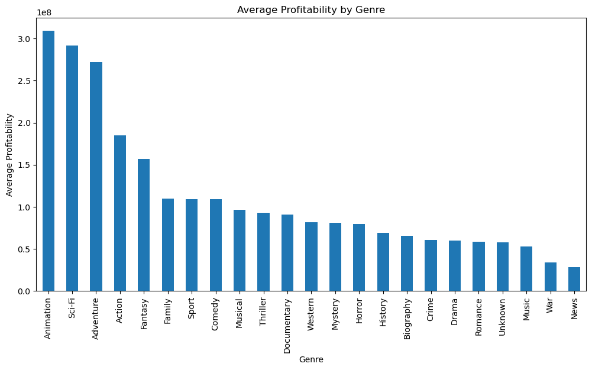

# Movie Market Analysis

## Overview
The **Movie Market Analysis** project aims to explore trends and factors affecting the profitability of movies. By analyzing data from multiple sources such as Box Office Mojo, IMDB, Rotten Tomatoes, TheMovieDB, and The Numbers, the project seeks to uncover insights that can guide film production decisions for maximizing profitability.

## Business Understanding
To guide the analysis, the following key business questions were addressed:

1. **What types of films are currently performing well at the box office?**
   - Analyzed box office performance across different genres to identify which genres generate the highest revenue.

2. **Which factors are associated with higher box office revenue?**
   - Investigated various factors such as budget, release date, and runtime to determine their impact on box office success.

3. **What actionable strategies can be derived from the analysis to guide the studio’s film production decisions?**
   - Provided concrete recommendations based on data analysis to help studios make informed decisions about the types of films to produce.

## Data Understanding and Analysis
The analysis utilized the following datasets:

- **Box Office Mojo**: Box office gross figures.
- **IMDB**: Movie metadata, including genres and ratings.
- **Rotten Tomatoes**: Movie info and reviews.
- **TheMovieDB**: Movie details and popularity metrics.
- **The Numbers**: Production budgets and gross revenues.

### Key Findings

1. **Most Profitable Genres**: 
   - **Visualization 1**: Average Worldwide Gross by Genre
     

   Animation and Sci-Fi showed the highest average worldwide gross, while Drama and Comedy had the highest profitability margins.

2. **Correlation with Revenue**: 
   - **Visualization 2**: Correlation between Production Budget and Worldwide Gross
     

   A strong positive correlation (0.78) was found between production budgets and worldwide gross revenues.

3. **Profitability Influences**: 
   - **Visualization 3**: Profitability by Genre
     

   Higher production budgets and certain genres (Drama and Comedy) significantly impact profitability. Films in higher revenue quartiles generally show better profitability.

## Conclusion
Based on the analysis, studios are recommended to focus on high-budget films and target genres that exhibit strong profitability. Investing in genres like Animation and Sci-Fi can lead to higher worldwide grosses, while Drama and Comedy offer favorable profitability margins. Additionally, prioritizing high-revenue potential projects is suggested for maximizing profitability.

## Thank You

For any questions or further information, please contact:
- **Name**: [Samwel Waithaka](https://github.com/IdrisFallout)
- **LinkedIn**: [LinkedIn](https://www.linkedin.com/in/idrisfallout)
- **Website**: [Website](https://waithakasam.com)
